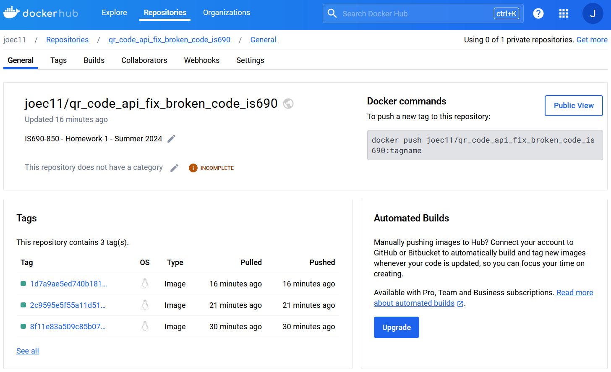
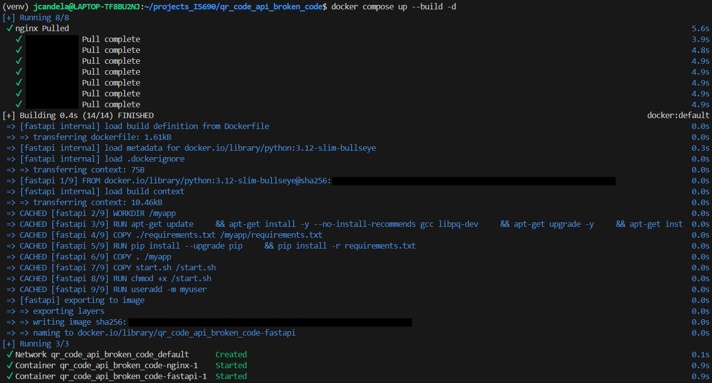
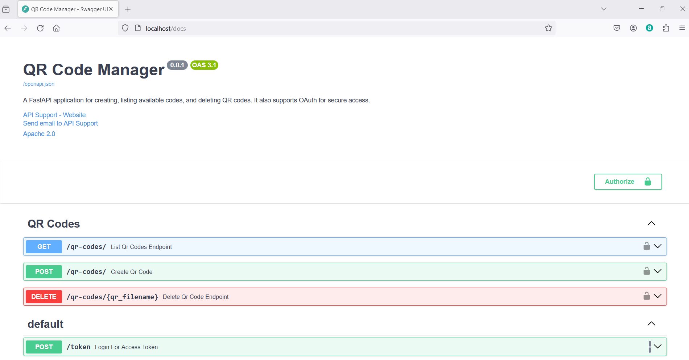
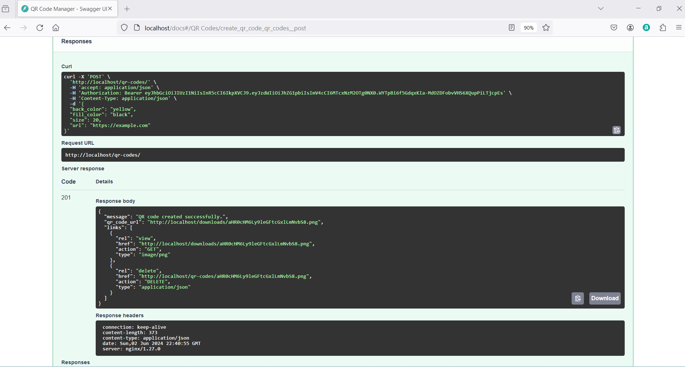
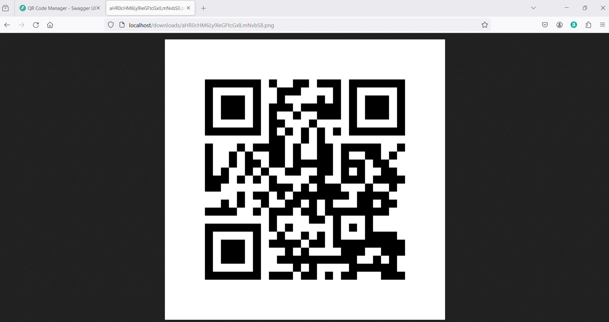
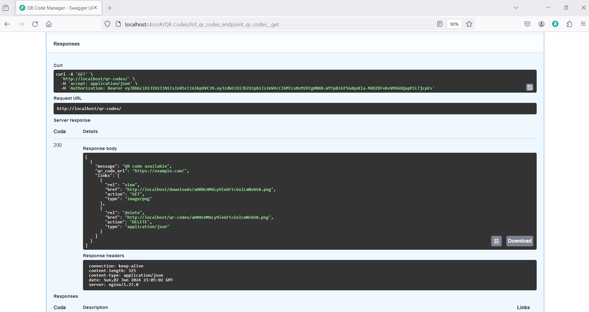
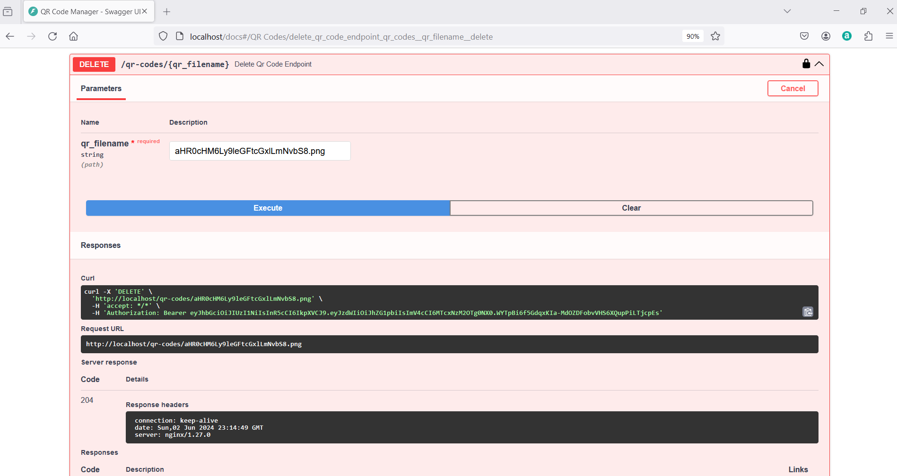
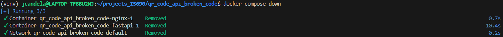

# QR Code API Broken Code Fix

## [GitHub Actions for test and build-and-push-docker Jobs](https://github.com/joec11/qr_code_api_fix_broken_code_is690/actions/runs/9340441534)

## DockerHub Repository

[Link to Public DockerHub Repository](https://hub.docker.com/r/joec11/qr_code_api_fix_broken_code_is690/tags)

## Build and Run Docker Images on Localhost

## Launch QR Code Manager on Localhost

## Create, view, retrieve, and delete qr codes using the QR Code Manager on Localhost
Create QR Codes

View Created QR Code

Retrieve QR Codes

Delete a QR Code

## docker compose down on Localhost

